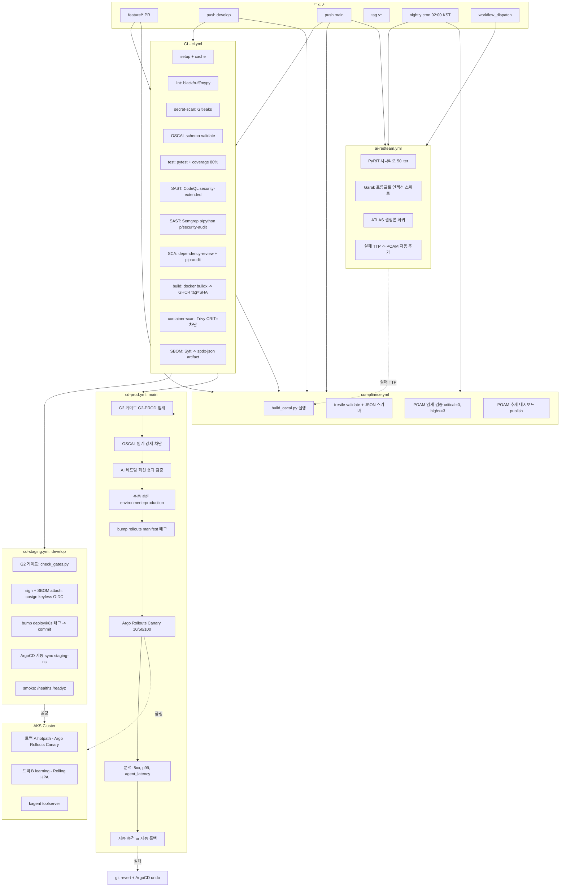

# UAV AI SOC CI/CD 파이프라인 설계 문서

**작성자**: pipeline-designer
**버전**: 1.0 (Phase 1 설계)
**원칙**: 기존 자산 강화·승격, OIDC 우선, GitOps 형상 일치, OSCAL 컴플라이언스 게이트화

---

## 0. 설계 요약

본 설계는 **기존 CI를 강화**(시크릿/컨테이너/SBOM/공급망/AI 레드팀/OSCAL)하고 **CD example을 정식 승격**(OIDC 인증·서명·카나리)한다. 핵심 추가물은 다음과 같다.

| 구분 | 산출 워크플로 (`.github/workflows/`) | 목적 |
|------|--------------------------------------|------|
| 강화 | `ci.yml` (기존 강화) | PR/Push 게이트 — 품질·테스트·SAST·SCA·시크릿·SBOM·컨테이너 스캔 |
| 신규 | `cd-staging.yml` | develop → staging AKS (Rolling) |
| 신규 | `cd-prod.yml` | main → prod AKS (Argo Rollouts 카나리, OSCAL 강제) |
| 신규 | `compliance.yml` | OSCAL 빌드·스키마 검증·POAM 임계 — PR/main/nightly |
| 신규 | `ai-redteam.yml` | PyRIT/Garak/MITRE ATLAS — nightly + manual + main 사전 게이트 |
| 신규 | `release-signing.yml` (재사용 가능 워크플로) | cosign 서명·SLSA provenance 생성 |

---

## 1. 전체 파이프라인 토폴로지

### 1.1 전체 흐름 (Mermaid)



### 1.2 ASCII 요약 (스테이지 순서)

```
[feature/* PR]
  └─ ci.yml: setup -> [lint || secret-scan || oscal-schema] -> test
     -> [codeql || semgrep] -> [dep-review || pip-audit]
     -> build -> trivy -> syft
  └─ compliance.yml: build_oscal -> trestle validate (PAaM 임계는 경고만)

[push develop]
  └─ ci.yml 전체 + cd-staging.yml
     -> G2 게이트 -> cosign 서명 -> SBOM attach
     -> deploy/k8s 태그 bump (staging overlay)
     -> ArgoCD sync (Rolling) -> smoke

[push main]
  └─ ci.yml 전체
  └─ ai-redteam.yml (선행) -> 결과 캐시
  └─ cd-prod.yml:
     G2 게이트(PROD 임계) -> OSCAL 게이트(critical=0, high<=3, 스키마 통과)
     -> AI 레드팀 결과 검증 -> [수동 승인]
     -> Argo Rollouts Canary 10% (10분) -> 50% (30분) -> 100%
     -> 분석 실패 시 자동 롤백 (git revert)

[nightly 02:00 KST]
  └─ ai-redteam.yml (전체 시나리오 + PyRIT 확장)
  └─ compliance.yml (POAM 추세)
  └─ trivy 재스캔(최신 이미지) -> 신규 CVE 발견 시 이슈 자동 발행
```

---

## 2. OSCAL 컴플라이언스 게이트 배치

### 2.1 실행 시점·모드

| 트리거 | 실행 내용 | 모드 |
|--------|-----------|------|
| feature/* PR | `build_oscal.py` + 스키마 검증 | **경고** (PR 코멘트로 갭 노출) |
| push develop | 위 + POAM 임계 검증 | **경고** (staging은 통과) |
| push main → cd-prod | 위 + POAM 임계 검증 + 산출물 sign attach | **차단** (배포 게이트) |
| nightly | POAM 추세 publish + 대시보드 갱신 | **추적** |

> 근거: 사용자 결정 — "OSCAL 게이트 차단 정책 = 스키마 검증 + POAM 미해결 위험 임계값 차단"

### 2.2 스키마 검증 도구 선택

| 도구 | 역할 | 채택 |
|------|------|------|
| `compliance-trestle` (Python) | OSCAL 1.1.2 모든 모델(catalog/profile/SSP/component-def/POAM) 스키마 검증 | **1차** |
| 자체 JSON 스키마 (`jsonschema`) | trestle 미지원 또는 보조 검증 | **2차 보조** |
| `python -c "import json,glob; ..."` | well-formed JSON 확인 | **3차 sanity** |

**실행 명령 (compliance.yml 내부)**:
```bash
pip install compliance-trestle==3.* jsonschema
python compliance/oscal/build_oscal.py compliance/oscal
trestle validate -f compliance/oscal/catalog/nist-ai-rmf-catalog.json
trestle validate -f compliance/oscal/profile/uav-soc-ai-rmf-profile.json
trestle validate -f compliance/oscal/component-definition/uav-soc-components.json
trestle validate -f compliance/oscal/ssp/uav-soc-ssp.json
trestle validate -f compliance/oscal/poam/uav-soc-poam.json
python compliance/oscal/check_poam_thresholds.py \
  --critical-max 0 --high-max 3 --partial-warn 25
```

> `check_poam_thresholds.py`는 신규 작성 대상(test-engineer/security-scanner 협업, `compliance/oscal/` 또는 `scripts/` 배치). POAM JSON을 파싱해 `risk-status` 또는 사용자 정의 severity 필드로 카운트한다.

### 2.3 POAM 임계값

| 항목 | prod 차단 | staging 경고 | 비고 |
|------|-----------|--------------|------|
| critical 미해결 | > 0 | > 0 | 절대 차단 |
| high 미해결 | > 3 | > 5 | 방산 컨텍스트, AI 레드팀 신규 TTP 누락 한계 |
| partial 비율 | — | > 60% | 추세 모니터링 |
| 만기 초과 마일스톤 | > 0 | 경고 | due-date 지남 |

### 2.4 AI 레드팀 실패 → POAM 자동 추가 흐름

```
ai-redteam.yml
  ├─ PyRIT/Garak/ATLAS 실행 -> failed_ttps.json
  ├─ 실패 TTP가 있을 경우:
  │    1) build_oscal.py --append-poam failed_ttps.json
  │    2) compliance/oscal/poam/uav-soc-poam.json 갱신
  │    3) PR 자동 생성 (gh pr create) -- ci-bot
  │    4) PR 본문에 ATLAS TTP ID + 매핑 통제 (MEASURE 2.7 등)
  └─ 다음 cd-prod 실행 시 갱신된 POAM 임계로 게이트 평가
```

### 2.5 OSCAL ↔ 게이트 매핑

| 게이트 | 충족 통제 (OSCAL Component) |
|--------|------------------------------|
| SAST/SCA/시크릿/컨테이너 스캔/SBOM/서명 | Supply Chain Integrity (GOVERN 6.1, MAP 4.1, MANAGE 3.1) |
| AI 레드팀 게이트 (PyRIT/ATLAS) | AI Red Team Gate (MEASURE 2.7, 2.6, 3.1, 3.2, GOVERN 4.3) |
| ArgoCD GitOps + Argo Rollouts | Deployment & GitOps (MANAGE 2.4, MAP 3.5) |
| CI/CD 전체 파이프라인 | CI/CD Pipeline (MEASURE 2.1, 2.3, MANAGE 1.3) |
| Prometheus/Grafana + DORA | Observability (MEASURE 2.4, MANAGE 4.1, 3.2) |

---

## 3. 브랜치 전략 매트릭스

| 브랜치 | 환경 | 트리거 | 게이트 | 배포 방식 | 승인 |
|--------|------|--------|--------|-----------|------|
| `feature/*` | preview (ephemeral, 옵션) | PR open/sync | ci.yml 전체 + OSCAL 스키마(경고) | 빌드만, 배포는 X | 자동 |
| `develop` | staging (`dah-soc-staging` ns) | push | ci.yml + cd-staging | Rolling (양 트랙) | 자동 |
| `main` | production (`dah-soc` ns) | push | ci.yml + ai-redteam + compliance + cd-prod | Canary(A) + Rolling(B) | **수동** environment=production |
| `hotfix/*` → main (fast-track) | production | PR + merge | ci.yml + 축소 G2 (FP-재발만) + OSCAL 임계 | Canary 50%부터 시작 | 수동 (2인) |
| `v*` tag | production (불변 릴리스) | tag push | release-signing 재사용 워크플로 | 이미지 영구 보관 + provenance | 자동 |

### 3.1 핫픽스 절차

```
1. main에서 hotfix/<issue> 분기
2. 수정 + 테스트
3. PR (label: hotfix) -> ci.yml + 축소 G2 (FP-재발률만, ATLAS 생략)
4. 머지 -> cd-prod.yml 트리거
   - OSCAL critical=0 강제 (high 임계는 +2 완화 허용 label 시)
   - Argo Rollouts: 10% 단계 스킵, 50% -> 100% 단축 (15분 분석)
5. 머지 직후 nightly 강제 트리거 (workflow_dispatch ai-redteam.yml)
```

### 3.2 롤백 절차

| 시나리오 | 동작 | 도구 |
|----------|------|------|
| 카나리 분석 실패 | 자동 git revert (bump 커밋) → ArgoCD 재동기화 | Argo Rollouts |
| 배포 후 발견된 회귀 | 수동 `gh workflow run rollback.yml --ref main --field commit=<SHA>` | GitHub Actions + Argo |
| OSCAL 임계 사후 위반 | nightly 감지 → 자동 이슈 발행 + Slack alert | compliance.yml |
| 시크릿 노출 | `secret-scan` 게이트 차단 + `gh secret revoke` 안내 | Gitleaks |

---

## 4. 배포 전략 (deployment-strategies 스킬 반영)

### 4.1 트랙별 매핑

| 트랙 | 워크로드 | 현재 상태 | 신규 전략 | 이유 |
|------|---------|-----------|-----------|------|
| A (hotpath) | `soc-hotpath` Deployment, replicas=1, **Recreate** | 상태 보유, 단일 레플리카 | **Argo Rollouts Canary** (Deployment → Rollout 마이그레이션) | 미션 크리티컬 저지연, 자동 분석 롤백 |
| B (learning) | `soc-learning` Deployment + HPA(1-4) | 비동기/버스티 | **Rolling** (현행 유지) | 무중단 불필요, 비용 최소 |
| kagent toolserver | `50-kagent-toolserver.yaml` | 사이드카 | **Rolling** | 인프라 컴포넌트 |

### 4.2 트랙 A — Argo Rollouts Canary 명세

> **주의**: 현재 트랙 A는 `replicas: 1 / strategy: Recreate` (상태 보유). Canary 전환을 위해 `kind: Deployment` → `kind: Rollout` 마이그레이션 필요. **상태 보유 컴포넌트(AlertCorrelator)는 별도 StatefulSet으로 분리** 후, stateless 추론 부분만 replicas=2+ Canary로 운영하는 것을 권고.

```yaml
# 개념 (deploy/k8s/30-deployment-a-hotpath.yaml 리팩토링 예시)
apiVersion: argoproj.io/v1alpha1
kind: Rollout
metadata: { name: soc-hotpath, namespace: dah-soc }
spec:
  replicas: 2  # Canary 위해 2로 증가 (상태 보유는 StatefulSet 분리 가정)
  strategy:
    canary:
      maxSurge: 1
      maxUnavailable: 0
      steps:
        - setWeight: 10
        - pause: { duration: 10m }
        - analysis:
            templates: [{ templateName: hotpath-success-rate-latency }]
        - setWeight: 50
        - pause: { duration: 30m }
        - analysis:
            templates: [{ templateName: hotpath-success-rate-latency }]
        - setWeight: 100
```

**AnalysisTemplate (자동 롤백 트리거)**:

| 메트릭 | 소스 | 임계 | 위반 시간 | 동작 |
|--------|------|------|----------|------|
| HTTP 5xx 비율 | Prometheus `http_requests_total{code=~"5.."}` | > 1% | 2분 연속 | 자동 롤백 |
| p99 응답시간 | Prometheus `histogram_quantile(0.99, http_request_duration_seconds_bucket)` | > 2초 | 5분 연속 | 자동 롤백 |
| agent_latency p99 | 커스텀 `agent_latency_seconds_bucket` | > 5초 | 5분 연속 | 자동 롤백 |
| Pod 재시작 | `kube_pod_container_status_restarts_total` | > 3회 | 10분 | 자동 롤백 |
| RAGAS faithfulness | 인플라이트 평가 `ragas_faithfulness_score` | < 0.75 | 10분 평균 | 자동 롤백 |

### 4.3 트랙 B — Rolling 유지

기존 `40-deployment-b-learning.yaml`의 `replicas: 1 + HPA(1-4)`를 유지하되, `strategy: RollingUpdate` 명시(현재 미명시) 및 `maxSurge: 1 / maxUnavailable: 0` 추가.

### 4.4 헬스체크 보강

| 트랙 | 현재 | 보강 |
|------|------|------|
| A | liveness/readiness 정의됨 | **startupProbe 추가** (모델 로드 300s 허용), `failureThreshold: 3` 명시 |
| B | liveness만 정의 | **readinessProbe 추가** (`/readyz`), startupProbe 추가 |

### 4.5 DORA 측정 포인트

| 지표 | 측정 소스 | 노출 |
|------|----------|------|
| 배포 빈도 | ArgoCD `argocd_app_sync_total{phase="Succeeded"}` | Grafana 대시보드 |
| 변경 리드타임 | GitHub Actions `workflow_run` 이벤트 (commit→sync) | Pushgateway |
| 변경 실패율 | ArgoCD sync 실패율 + Rollouts abort 횟수 | Grafana |
| MTTR | Alertmanager incident open→close 시간 | Grafana |

---

## 5. 게이트 순서·차단 정책 매트릭스

### 5.1 CI 게이트 (ci.yml — feature/* PR & push)

| # | 잡 | 작업 | 의존 | 타임아웃 | 차단/경고 | 재시도 | 예상 소요 |
|---|----|------|------|---------|-----------|--------|-----------|
| 1 | `setup` | checkout + pip 캐시 워밍 | — | 2분 | 차단 | 1 | 30초 |
| 2a | `lint` | black --check, ruff, mypy | setup | 5분 | **차단** | 0 | 2-3분 |
| 2b | `secret-scan` | Gitleaks (history+staged) | setup | 3분 | **차단** | 0 | 1분 |
| 2c | `oscal-schema` | trestle validate 5종 | setup | 3분 | PR=경고 / main=차단 | 0 | 1분 |
| 3 | `test` | pytest + coverage 80% 전체 / 90% 핵심경로 | lint | 10분 | **차단** | 1 | 5-8분 |
| 4a | `codeql` | security-extended | setup | 15분 | Crit/High 차단 | 0 | 8-12분 |
| 4b | `semgrep` | p/python p/security-audit | setup | 5분 | High 차단 | 0 | 2-3분 |
| 5a | `dependency-review` | actions/dependency-review-action | PR | 3분 | High 차단 (PR only) | 0 | 30초 |
| 5b | `pip-audit` | `pip-audit -r` | setup | 5분 | High 차단 | 1 | 1-2분 |
| 6 | `build` | docker buildx + buildx-gha-cache → GHCR (`sha-<git-sha>` 태그) | test | 10분 | **차단** | 1 | 4-7분 |
| 7 | `container-scan` | Trivy image + config | build | 5분 | Critical=차단, High=경고 | 1 | 2-3분 |
| 8 | `sbom` | Syft → `spdx-json` artifact (90일 보존) | build | 3분 | 경고 | 0 | 1분 |

**전체 CI 목표 소요시간**: 12-15분 (병렬화 최대)

### 5.2 OSCAL 게이트 (compliance.yml)

| # | 잡 | 트리거 | 차단/경고 |
|---|----|--------|-----------|
| 1 | `oscal-build` | PR, push develop/main, nightly | 차단 (build_oscal.py 실패) |
| 2 | `oscal-validate` | 동일 | 차단 (스키마 위반) |
| 3 | `poam-threshold` | push main, nightly | **prod=차단** (critical=0, high≤3), staging=경고 |
| 4 | `dashboard-publish` | push main, nightly | 경고 (gh-pages publish) |

### 5.3 AI 레드팀 게이트 (ai-redteam.yml — ai-redteam-engineer 상세 위임)

| # | 잡 | 트리거 | 차단/경고 |
|---|----|--------|-----------|
| 1 | `pyrit-scenarios` | nightly + manual + main 사전 | **main=차단** (회귀 시) |
| 2 | `garak-prompt-injection` | nightly + manual | 경고 + POAM 자동 추가 |
| 3 | `atlas-redteam-bench` | push main + nightly | **차단** (결정론 회귀) |
| 4 | `poam-append` | 1-3 중 실패 발생 시 | 자동 PR |

### 5.4 CD 게이트 (cd-prod.yml — main 한정)

| # | 잡 | 작업 | 차단/경고 | 비고 |
|---|----|------|-----------|------|
| 1 | `g2-gate` | `check_gates.py` (FP재발 + ATLAS + KPI 종합) | **차단** | test-engineer 신규 작성 |
| 2 | `oscal-gate` | POAM 임계 강제 (critical=0, high≤3) | **차단** | compliance.yml 호출 |
| 3 | `ai-redteam-check` | 최근 24h 내 ai-redteam.yml 통과 검증 | **차단** | 워크플로 아티팩트 조회 |
| 4 | `image-build-sign` | buildx + cosign keyless (OIDC) + SBOM attest | **차단** | release-signing 재사용 |
| 5 | `prod-approval` | environment=production manual approval | **수동** | 2인 검토 권장 |
| 6 | `gitops-bump` | `deploy/k8s` 태그 bump 커밋 | **차단** | A=Rollout, B=Deployment |
| 7 | `argocd-sync-wait` | ArgoCD CLI로 sync 완료 대기 | **차단** | 10분 타임아웃 |
| 8 | `rollouts-analysis` | Argo Rollouts Canary 자동 분석 | **차단/자동롤백** | 4.2 임계 |
| 9 | `post-deploy-smoke` | `/healthz /readyz /metrics` 외부 호출 | 차단 (10분 내 실패 시 롤백) | — |

### 5.5 차단 정책 요약

- **시크릿 노출**: 즉시 차단, 토큰 회수 안내 + 이슈 자동 발행
- **컨테이너 Critical CVE**: 빌드 산출물 폐기 (`docker rmi`), 배포 차단
- **OSCAL critical POAM**: prod 차단 (예외 없음). staging은 경고
- **AI 레드팀 회귀**: 24h 게이트 미통과 시 prod 차단
- **카나리 분석 실패**: 자동 git revert → ArgoCD 자동 복원

---

## 6. 팀원에게 전달할 핵심 정보 요약

### infra-engineer
GitHub Actions 러너는 `ubuntu-latest`(CI/CD 기본) + `ubuntu-latest-4-cores`(컨테이너 빌드·Trivy·CodeQL 가속). GPU는 현재 게이트 불필요 (PyRIT/Garak는 Azure OpenAI 원격 호출). OIDC를 GHCR push·Azure 인증·cosign keyless에 일관 사용하고 `GHCR_PAT`·`AZURE_CREDENTIALS_JSON` 등 long-lived secret을 제거. AKS 네임스페이스는 `dah-soc`(prod), `dah-soc-staging`(신규). ArgoCD `dah-soc` project에 staging Application 추가 필요.

### test-engineer
**`benchmarks/check_gates.py`를 신규 작성**. 입력은 `run_fp_recurrence.py`·`run_atlas_redteam.py`·`run_kpi.py`의 JSON 출력(`benchmarks/results/`). 종합 게이트 로직 + 실패 시 비정상 종료(exit 1) + `--emit-poam` 옵션으로 `failed_ttps.json` 산출. 또한 pytest 커버리지 임계는 전체 80%, 핵심 경로(`agents/`, `core/`) 90%로 강제.

### quality-gate
black/ruff/mypy 명령은 기존 ci.yml의 lint job 활용. **ruff 설정에 `select = ["E", "F", "I", "B", "S", "PL", "TID", "PT"]` 추가 권장**, mypy는 `--strict` 또는 최소 `--disallow-untyped-defs` + `--warn-unused-ignores`. pre-commit 설정은 ci.yml lint job과 정합 유지(중복 명령 동일 옵션).

### security-scanner
공급망 무결성 풀스택: ① GitHub Actions SHA 핀(모든 third-party action), ② Gitleaks(이력+staged), ③ Semgrep(p/python p/security-audit), ④ pip-audit, ⑤ Trivy(image+config, Critical 차단), ⑥ Syft SBOM(spdx-json artifact 90일), ⑦ cosign keyless(OIDC) 서명, ⑧ SLSA provenance L3 (`slsa-github-generator/generator_container_slsa3.yml@v2.0.0`). 모든 시크릿 OIDC 우선, PAT 제거 로드맵 작성.

### ai-redteam-engineer
`ai-redteam.yml` 신규 작성 위임. PyRIT 50회 반복 + Garak 프롬프트 인젝션/탈옥 + MITRE ATLAS 결정론 회귀 + RAG 포이즌 시나리오 포함. 실패 TTP는 `failed_ttps.json`으로 산출 → `compliance/oscal/build_oscal.py --append-poam` 호출로 POAM 자동 갱신 → ci-bot이 PR 생성. main push 전 24h 통과 이력 없으면 cd-prod 차단.

### monitoring-specialist
ServiceMonitor 추가(현재 monitoring 라벨 존재). DORA 4지표 수집(배포 빈도/리드타임/실패율/MTTR) + AI-SOC 메트릭(`agent_latency_seconds`, `ragas_faithfulness_score`, `false_positive_recurrence_rate`, `atlas_ttp_detection_total`) + OSCAL 컴플라이언스 추세(`oscal_implemented_total`, `oscal_partial_total`, `oscal_planned_total`) 대시보드. Argo Rollouts AnalysisTemplate 5종(5xx/p99/agent_latency/restarts/ragas)을 모니터링과 함께 PR.

### pipeline-reviewer (다음 단계)
본 설계 문서 + 02_pipeline_config 산출물 + 03 보안/품질 게이트 산출물 종합 리뷰. 특히 OSCAL 게이트의 prod 차단 임계가 운영 가능한지 + 카나리 분석 메트릭이 실제 가용한지 검증.

---

## 7. 러너·시크릿·배포 타깃 사양 (infra-engineer 인계용)

### 7.1 GitHub Actions 러너

| 워크플로 | 러너 | 사유 |
|----------|------|------|
| ci.yml lint/test/secret/oscal | `ubuntu-latest` | 경량 |
| ci.yml codeql/semgrep/build/trivy | `ubuntu-latest-4-cores` (또는 -8-cores) | 빌드·스캔 가속, 15→8분 |
| ai-redteam.yml | `ubuntu-latest` (Azure OpenAI 원격) | GPU 불필요 |
| compliance.yml | `ubuntu-latest` | 가벼움 |
| cd-staging/cd-prod | `ubuntu-latest` | OIDC 토큰 발급 |
| release-signing 재사용 | `ubuntu-latest` (cosign keyless) | OIDC 필수 |

> **self-hosted 러너는 현재 불필요**. 향후 PyRIT 대규모 캠페인 (>500 iter) 또는 로컬 모델 평가 시점에 검토.

### 7.2 시크릿 (OIDC 우선, PAT 최소화)

| 이름 | 종류 | 용도 | 대체 가능? |
|------|------|------|-----------|
| `AZURE_OIDC_CLIENT_ID` | OIDC | Azure 로그인 (Sentinel/OpenAI 평가용) | — |
| `AZURE_TENANT_ID` | 일반 | OIDC 토큰 발급 | — |
| `AZURE_SUBSCRIPTION_ID` | 일반 | 동일 | — |
| `GHCR_PAT` | **제거 대상** | 컨테이너 push | **OIDC + `id-token: write` + `packages: write`** |
| `COSIGN_*` | OIDC keyless | 서명 (Fulcio + Rekor) | — |
| `OPENAI_API_KEY_TEST` | Azure Key Vault 참조 | PyRIT 평가 전용(rate-limited) | Azure Managed Identity |
| `SLACK_WEBHOOK_OPS` | 일반 | 배포·알람 통지 | — |
| `ARGOCD_AUTH_TOKEN` | 일반 | 동기화 상태 확인 (옵션) | OIDC 옵션 |

### 7.3 배포 타깃

| 타깃 | 값 |
|------|---|
| 컨테이너 레지스트리 | `ghcr.io/s1ns3nz0/uav-ai-soc` (불변 태그: `sha-<git-sha>`, `staging`, `prod`, `v*`) |
| AKS 클러스터 | 기존 dah-soc 클러스터 (사용자 운영) |
| ArgoCD 네임스페이스 | `argocd` |
| AKS 워크로드 네임스페이스 | `dah-soc` (prod), `dah-soc-staging` (신규) |
| ArgoCD Project | `dah-soc` (기존) |
| ArgoCD Applications | `dah-soc-workloads`(기존 prod), `dah-soc-workloads-staging`(신규), `dah-soc-monitoring`, `kube-prometheus-stack` |
| Argo Rollouts 컨트롤러 | 신규 설치 필요 (`kubectl create ns argo-rollouts && kubectl apply -n argo-rollouts ...`) |

### 7.4 GitHub Environments

| 이름 | 보호 규칙 |
|------|----------|
| `staging` | 보호 없음, develop만 배포 가능 |
| `production` | **required reviewers ≥ 1** (가능 시 2), wait timer 5분, main 브랜치만 배포 가능 |

---

## 8. 기존 자산 인벤토리 (강화 대상)

| 파일 | 현재 역할 | 강화 포인트 |
|------|----------|-----------|
| `.github/workflows/ci.yml` | lint/test/codeql/dep-review | secret-scan, semgrep, pip-audit, build, trivy, syft, oscal-schema 추가. SHA 핀 적용. coverage 임계 추가 |
| `deploy/ci/build-deploy.example.yml` | G2 → build/push → bump | `cd-staging.yml` + `cd-prod.yml`로 분리 승격. OIDC, cosign, SBOM attest, OSCAL 게이트, Rollouts Canary 추가 |
| `deploy/Dockerfile` | 단일 이미지 | 다단계 빌드 검토(Wolfi/distroless), non-root user, HEALTHCHECK 명시 |
| `deploy/k8s/30-deployment-a-hotpath.yaml` | Deployment Recreate | Rollout으로 마이그레이션 + AnalysisTemplate 추가 + 상태부 분리 검토 |
| `deploy/k8s/40-deployment-b-learning.yaml` | Deployment Rolling 암시 | strategy 명시 + readinessProbe + startupProbe 추가 |
| `deploy/argocd/apps/soc.yaml` | prod 동기화 | staging Application 추가 (`apps/soc-staging.yaml`) |
| `compliance/oscal/build_oscal.py` | 단일 소스 생성기 | `--append-poam` 옵션 추가, CI 통합 |
| `benchmarks/run_*.py` | 평가 스크립트 | `check_gates.py` 신규 작성(test-engineer) |

---

## 9. 캐싱 전략

| 대상 | 키 | 절약 |
|------|-----|------|
| pip | `${{ runner.os }}-pip-${{ hashFiles('pyproject.toml','requirements*.txt') }}` | 설치 30-60초 → 5초 |
| Docker buildx | `type=gha,mode=max` | 빌드 5-7분 → 1-2분 |
| Trivy DB | `~/.cache/trivy` | DB 다운로드 30초 → 0 |
| CodeQL DB | actions/cache로 캐시 | 분석 12분 → 8분 |
| compliance-trestle | pip 캐시 공유 | — |

---

## 10. 보류·결정 필요 사항

| # | 항목 | 비고 |
|---|------|------|
| 1 | 트랙 A의 상태 보유 컴포넌트(AlertCorrelator) StatefulSet 분리 여부 | infra-engineer 결정 — 분리 안 하면 Canary 대신 Blue-Green 권장 |
| 2 | `dah-soc-staging` ns/Application 신설 승인 | 사용자 승인 필요 |
| 3 | OSCAL `high` 미해결 prod 차단 임계(3) 적정성 | 초기 운영 1-2주 관찰 후 조정 |
| 4 | self-hosted GPU 러너 필요 시점 | PyRIT 캠페인 확장 시 재논의 |
| 5 | SLSA L3 채택(현재 GitHub 호스티드 빌더) vs L4 | 방산 인증 요구사항 확인 후 |
