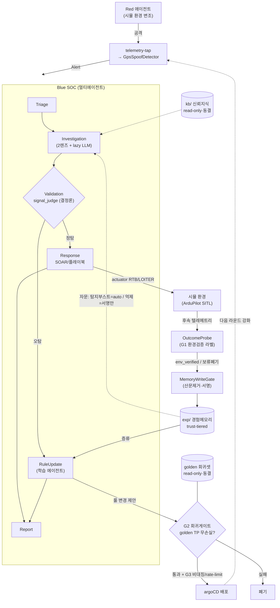
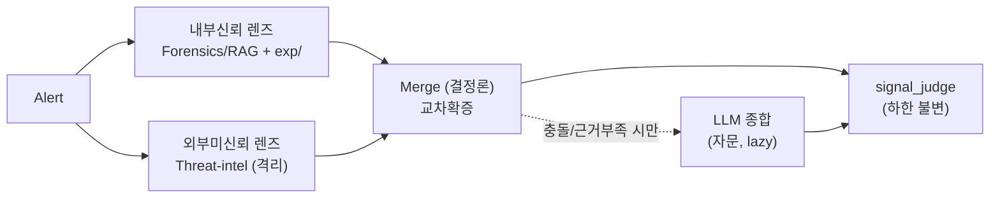

# ADR 0002 — 풀자동 자가발전 Blue SOC 아키텍처 (환경검증 폐루프)

- 상태: 제안 (2026-06)
- 담당: 양진수 (방어 에이전트 / 아키텍처 lane)
- 관련: ADR 0001(RAGFlow), `docs/agent-pipeline-structure-comparison.pdf`

## 한 줄 요약

본선은 **사람 개입 없는(HITL 불가) Red vs Blue 공방**이다. 따라서 Blue SOC는
스스로 배우며 강해져야 하지만, 자가학습은 곧 **경험메모리 포이즈닝**이라는 새
공격면을 연다. 이를 막기 위해 사람 대신 **시뮬 환경의 실제 결과(텔레메트리)를
신뢰 심판으로** 삼고, 3개 자동 게이트로 자가발전을 안전하게 닫는다.
핵심 원리: **"텍스트(주장)는 조작 가능하지만, 물리(결과)는 조작 불가."**

---

## 배경

- 현재 SOC는 6-에이전트 순차 파이프라인이다:
  `Triage → Investigation → Validation → {Response | RuleUpdate} → Report`.
- `docs/agent-pipeline-structure-comparison.pdf` 실측 결론(전제):
  1. **토폴로지는 품질(FPR/FNR)을 안 바꾼다. 효율만 바꾼다.** 5개 구조가 품질 동률.
  2. **품질의 단 하나의 레버는 judge(판정기)** 지 토폴로지가 아니다.
  3. LLM은 의사결정이 아니라 *서술*이므로 핫패스에서 빼야 한다(lazy/on-demand).
  4. 결정론 `signal_judge`는 둔하지만 **S5 프롬프트 인젝션에 견고**, LLM-judge는
     맥락을 잘 잡지만 인젝션에 뚫린다 → **판정권을 LLM에 주지 않는다.**
- 본선 제약(신규): **운용자 개입 불가 = 풀자동.** 기존 HITL 기반 가드(분석가 서명,
  사람 룰 리뷰)를 **그대로 쓸 수 없다.**
- 따라서 "자가발전(self-improving)"이 필수가 되는데, 이는 PDF가 경고한
  **경험메모리 포이즈닝**(S5의 확장 공격면)을 새로 연다.

> 미해결 의존: Red 에이전트 측 입력 규격/공격 카탈로그는 타 팀원 자료 대기 중.
> 본 ADR은 그와 무관하게 성립하도록 **풀자동 동작을 기준선**으로 설계한다.

---

## 결정

다음을 한 묶음으로 채택한다.

### D1. WizBlue는 3렌즈가 아니라 "신뢰경계 기반 2렌즈"로 분해

3렌즈(Forensics·Threat-intel·Signal-correlation)를 그대로 베끼지 않는다. 분해의
유일한 정당화 기준은 **경계가 실제로 다른가**(신뢰 / 장애·스케일 / 배포)이다.

- **내부신뢰 렌즈** = Forensics/RAG (+ 경험메모리). 출처 `kb/`·`exp/` 가드레일 통과분.
- **외부미신뢰 렌즈** = Threat-intel. 인젝션 유입면 → 격리.
- **Signal-correlation은 동급 렌즈가 아니다.** `core/correlation.py`의
  `AlertCorrelator`는 *단일 경보*가 아니라 *경보 스트림(슬라이딩 윈도우)* 위에서
  돌아 입력 단위가 다르다 → 파이프라인 **앞단 집약기**로 유지(현행대로).

근거: 모든 분리에 *이유*가 하나씩 붙는다(신뢰경계). "베꼈다"가 아니라 "신뢰 안 되는
외부 입력을 신뢰 입력과 격리한다"가 됨 → 보고서 "방어 견고성·구체성" 논리 강화.

### D2. Red/Blue/Green 중 Green은 Blue 내부 폐루프로 흡수

대회 구도가 **Red vs Blue 2자 공방**이므로 제3자 Green을 세우지 않는다. 또한 Green
기능(SOAR=대응, 룰 최적화)은 이미 Blue 안에 있다(`ResponseAgent`,
`RuleUpdateAgent`). 자가발전은 **Blue의 내부 폐루프**이며, 스토리는
*"라운드를 거듭할수록 Red에 적응해 점점 안 뚫리는 Blue"* 가 된다.

### D3. 풀자동 자가발전 폐루프 — HITL을 3개 자동 게이트로 대체

| 사람이 하던 것 | 풀자동 대체 |
|---|---|
| 분석가 서명(이게 진짜였나?) | **G1 환경검증 라벨** — 대응 후 시뮬 텔레메트리 결과 관측 |
| 사람 룰 리뷰(이 변경 OK?) | **G2 동결 회귀셋** — 모든 변경은 golden benchmark 통과 필수 |
| 억제 승인(이건 무시) | **G3 비대칭 + rate-limit** — 환경검증 다수확증 시에만 소폭 완화 |

### D4. 신뢰 라벨의 원천 = 환경검증(env_verified)

상대 Red의 정답도, 사람도 못 믿는다. 대응(actuator: RTB/LOITER) **이후의 실제
텔레메트리 결과**(위협효과 지속 여부·기체 상태 회복)를 심판으로 삼는다. 적은 경보
*텍스트*를 조작할 수 있어도 기체에 벌어진 *물리적 결과*는 조작할 수 없다.

### D5. LLM은 판정하지 않고 서술만 — lazy 호출 유지

`signal_judge`의 결정론 하한은 불변. LLM 종합은 렌즈 충돌/근거부족 시에만(자문).

### D6. 배포 = AKS 네이티브 하이브리드 패키징 (kagent CRD 비종속)

기존 kagent CRD 구성에 얽매이지 않고 **AKS(K8s)에 직접 배포**한다. 워크로드 성격이
정반대인 두 경계로만 쪼갠다(분리에는 이유가 있어야 한다 — 단순 모방 배제).

- **Deployment A — SOC 핫패스**(지연민감, 건당): LangGraph
  `Triage→Investigation(2렌즈 in-process)→Validation→Response→Report`. 상태 보유
  컴포넌트(`AlertCorrelator`/`DynamicsTracker`/Outcome 윈도우) 때문에 **single-replica**
  (또는 상태 외부화). 토폴로지는 품질 불변이므로 렌즈는 네트워크로 쪼개지 않는다.
- **Deployment B — 경험/학습**(버스티, 비동기): `OutcomeProbe → MemoryWriteGate →
  exp/ 적립 → RuleUpdate 증류 → argoCD PR`. 독립 스케일/롤아웃.
- **공유 상태 — exp/ 저장소**: RAGFlow + PVC(StatefulSet)로 **영속**. 자가발전
  메모리가 파드 재시작·라운드를 넘어 살아남아야 하므로 in-memory 금지(운영).
- **GitOps**: 룰 변경은 G2 회귀게이트 통과 후 argoCD 로 배포(자동 머지 없음).
- **관측/복원력**: OTel 트레이싱 + HPA(B 한정) + 자동복구. 비밀(서명 HMAC 키)은
  K8s Secret 으로 주입.

> 코드 영향 0 — 비즈니스 로직은 배포 비종속. 교체는 주입형 계약(`ExperienceStore`/
> `Signer`/리트리버)으로만 일어난다(kagent 채택 시에도 동일 코드 재사용).

---

## 근거 (왜 이게 사람 없이도 안전한가)

1. **결과기반 라벨(consequence, not claim).** 적이 "이건 양성이니 무시하라"를
   학습시키려면 env_verified 라벨이 '양성'이어야 하고, 그건 *실제로 효과가 없어야*
   나온다. 즉 **무시 학습을 시키려면 진짜로 공격을 안 하는 수밖에 없다.**
   진짜 공격은 물리 효과가 남아 TP로 라벨 → 억제에 사용 불가.
2. **자기 시험지 동결.** `kb/`(신뢰지식)·golden 회귀셋은 read-only·서명·고정.
   **쓰기 가능한 건 `exp/` 하나뿐**이고 그마저 *자문(advisory)*. 루프가 자기 평가
   기준을 못 고치게 한다(고치면 포이즈닝이 통함).
3. **비대칭 신뢰.** "더 의심(탐지 강화)"은 자유 — 최악이라야 FP 소폭 증가.
   "덜 의심(억제·룰 완화)"은 FN(진짜 공격 누락)을 부르는 치명 방향 → 강한 증거 +
   rate-limit. FN이 패배조건인 공방에서 합리적.
4. **judge 하한 불변.** 오염된 `exp/` 레코드도 verdict를 직접 못 뒤집는다.
   `signal_judge`의 `has_signal AND has_rule` 하한은 메모리가 못 건드리며,
   메모리는 confidence/similar_cases에 *자문*만 한다.
5. **기존 안전원칙과 정합.** `core/dynamics.py`는 이미
   *"`no_effect_sustained`는 효과 관측이 필요해 시간만으로 자동 도출하지 않는다"*
   고 명시. 본 설계의 OutcomeProbe는 이를 *어기지 않고 충족* — 시간이 아니라 **실제
   효과 관측(텔레메트리)** 으로 그 신호를 채운다.

---

## 컴포넌트 설계

### C1. `exp/` 경험메모리 네임스페이스

- 저장소: 기존 지식 KB(`kb/`)와 **물리적으로 분리된** `exp/` 컬렉션(RAGFlow,
  bge-m3 임베딩). 도메인 지식(static) ↔ 운영 경험(episodic) 분리.
- 모든 레코드에 **출처 등급(provenance)** 을 박는다:
  - `env_verified` — 시뮬 결과로 검증된 라벨 (풀자동의 최상위 신뢰)
  - `redgt_offline` — 예선·개발 단계 자체 Red(PyRIT) 정답 (오프라인 사전학습용)
  - `auto` — 시스템 추론 (최저 신뢰, 탐지부스트에만 사용)
- 레코드 스키마(예): `{scenario_id, signals(정규화), asset_id/tier, verdict(TP/FP),
  severity, judge 결정론 피처(has_signal/has_rule/corroborated/confidence),
  playbook_id, outcome(env), provenance, signature, ts}`.
- **금지:** 원시 LLM 산문 저장 금지(검색 시 재오염 방지). 구조화 필드만.

### C2. `OutcomeProbe` (G1 환경검증 라벨러) — 신규

- 위치(안): `sim_bridge/outcome.py` (telemetry-tap 역방향 관측).
- 입력: 대응 직후~윈도우 동안의 `TelemetryRecord` 스트림 + `SOCReport`.
- 출력: `env_verified` 라벨 ∈ {TP확정, FP확정, **보류(inconclusive)**}.
- 결정론 규칙(예): 대응(RTB/LOITER) 후 위협 지표(EKF 잔차/GPS 품질·`dwelling`·
  `lateral_correlation`)가 **회복** → FP 후보가 아니라 *대응 성공한 TP*;
  대응 없이도 효과 무발생이 **충분히 긴 윈도우·다수 관측** 지속 → FP 후보;
  애매하면 **보류**(메모리에 안 적음 — 적이 노리는 회색지대를 학습에서 배제).

### C3. `MemoryWriteGate` — `RuleUpdateAgent`를 학습 에이전트로 승격

- 현재 `agents/rule_update_agent.py`는 stub. 이를 **쓰기 게이트 + 패턴 증류**로 확장.
- 쓰기 시: provenance 검증 → 산문 제거·필드 정규화 → 서명/해시 → 중복 제거 →
  보류 라벨 폐기. `env_verified`/`redgt_offline`만 억제·완화 학습에 적격.

### C4. 읽기 — 비대칭 검색 (Investigation 내부신뢰 렌즈)

- 탐지부스트(confidence↑, similar_cases 추가) 검색 → `auto`까지 허용.
- 억제 판단 검색 → `env_verified`/`redgt_offline`만 채택.
- 기존 `kb/` 출처 가드레일 패턴을 `exp/` + trust-tier로 확장(동일 메커니즘).

### C5. 룰 최적화 + G2 회귀게이트

- `RuleUpdateAgent` 증류: 동일 시그니처 FP N건 → `sentinel/Analytic Rules/*.json`에
  예외/필터 *제안*; 룰부재 신종 TP → *새 탐지룰* 제안.
- **G2:** 모든 룰 변경은 머지/반영 전 `benchmarks/`(golden 회귀셋)을 통과해야 한다 —
  *알려진 TP가 여전히 전부 발화*. 실패 시 제안 폐기.
- **G3:** *강화*(새 탐지)는 저위험 자동; *완화*(예외/임계상향)는 env_verified
  다수확증 + 라운드당 변경량 상한(rate-limit). 자동 배포는 argoCD(gitops) 경유.

---

## 다이어그램

### 전체 풀자동 자가발전 폐루프

### Investigation — 신뢰경계 2렌즈

---

## 위협 모델 — 경험메모리 포이즈닝 방어 매핑

| 공격 | 방어 |
|---|---|
| 경보 텍스트/필드에 프롬프트 인젝션 | judge 결정론·LLM 판정권 박탈(불변) + LLM 산문 메모리 금지 |
| "이건 양성"을 반복 주입해 억제 학습 유도 | env_verified는 *실제 무효과*일 때만 양성 → 진짜 공격은 억제 불가(D4/근거1) |
| 지연발현 공격으로 관측 윈도우 속이기 | OutcomeProbe 보수적 윈도우 + 다수확증 + 보류 폐기(C2) |
| 룰을 완화시켜 탐지 무력화 | G2 회귀게이트(TP 무손실) + G3 완화 rate-limit |
| 평가 기준·신뢰지식 오염 | `kb/`·golden 동결·read-only, 쓰기는 `exp/`(자문)만 |

---

## 영향

- **신규:** `sim_bridge/outcome.py`(OutcomeProbe), `exp/` 네임스페이스 + 스키마.
- **변경:** `agents/rule_update_agent.py`(학습 에이전트로 승격 + 쓰기 게이트),
  `agents/investigation_agent.py`(2렌즈 분해 + `exp/` 비대칭 읽기),
  `core/models.py`(provenance/outcome 필드, exp 레코드 모델).
- **유지:** `signal_judge` 하한, `core/correlation.py` 앞단 집약기, Triage 가드레일.
- **측정 KPI(어려운/적대셋):** FP-재발률, 맥락 FP 포착률(AUTH-RETASK 1회 학습 후),
  포이즈닝 주입 시 견고성, 라운드별 FNR 추이(자가발전 입증), MTTD/MTTC.
- **발표 논리:** "분해는 정확도가 아니라 *격리*를 위함이며 ablation으로 품질 무손실을
  증명" + "사람 없이도 *결과기반 라벨*로 안전한 자가발전".

## 미해결 / 향후

- OutcomeProbe 관측 윈도우·보류 임계 튜닝(시뮬 실측 필요).
- Red 입력 규격 확정 시 redgt_offline 사전학습 파이프라인 연결.
- `exp/` 서명 방식(해시 체인 vs 키 서명) 확정.
