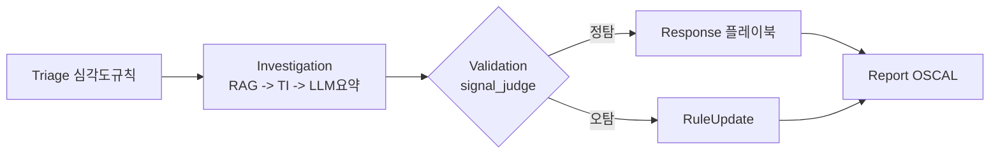
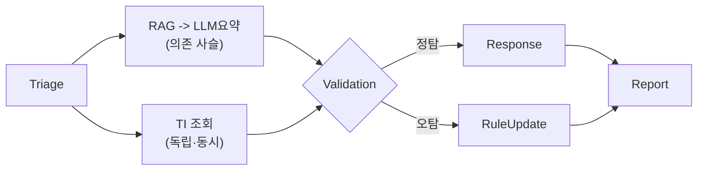
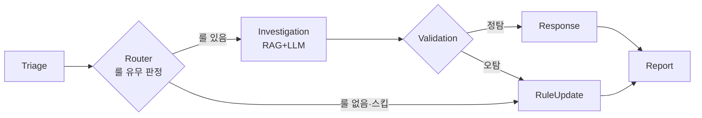
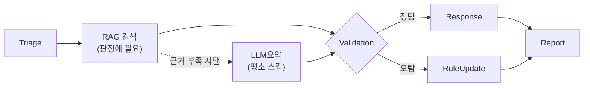
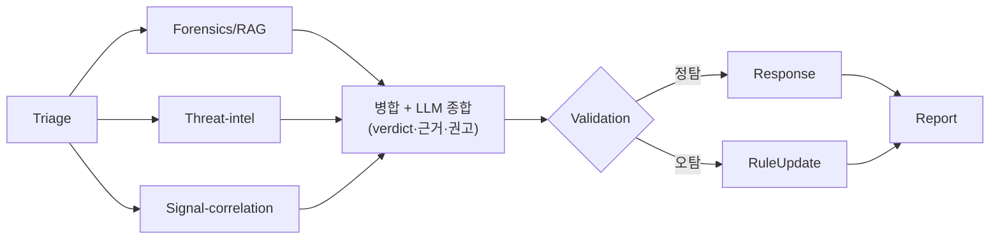

# SOC 에이전트 구조

- **Status**: To Do
- **담당자**: 황준식
- **마감일**: 2026-06-28
- **URL**: https://app.notion.com/p/388f5e835bb4800abe9cc7d5c6c910f1

---

(첨부 파일: agent-pipeline-structure-comparison.pdf)

---

## 에이전트 파이프라인 구조 비교

핵심 전제: 파이프라인에서 LLM 호출은 Investigation 요약 1곳뿐이고 그건 '사람이 읽는 서술'이다. 실제 의사결정(심각도·정탐/오탐·플레이북·OSCAL)은 전부 결정론 규칙 — 판정권을 LLM에 주지 않음(KPI 검증성 + S5 인젝션 방어). → 토폴로지를 바꿔도 품질(FPR/FNR)은 불변, 차이는 전부 효율.

### 구조 0 — Baseline (순차 DAG)

### 구조 1 — Parallel-Investigation (병렬 조사)

### 구조 2 — Router 조기탈출 (early-exit)

### 구조 3 — Supervisor 적응형 (최적)

### 구조 4 — Wiz-Blue 서브에이전트 분해

### 5개 구조 비교 (품질 전부 동률: P/R 1.0 · FPR/FNR 0 · 혼동행렬 TP11·FP0·FN0·TN6)

| 구조 | 핵심 아이디어 | 총지연(ms) | RAG/LLM | vs Baseline |
|---|---|---|---|---|
| 0 Baseline (순차 DAG) | Triage→Investigation(RAG→TI→LLM요약)→Validation→{Response\|RuleUpdate}→Report | 2738 | 17/17 | 기준 |
| 1 Parallel (병렬 조사) | 독립 TI를 RAG+LLM 사슬과 asyncio.gather 동시 실행 | 2448 | 17/17 | ~동일(무효) |
| 2 Router (조기탈출) | 룰 없는 경보(어차피 오탐)는 RAG+LLM 통째 스킵 | 1779 | 11/11 | -35% |
| 3 Supervisor (적응형·최적) | 판정-무관 LLM요약을 근거충분 시 생략(RAG는 유지) | 343 | 17/0 | -87.5% (8배) |
| 4 WizBlue (서브에이전트 분해) | Forensics/RAG·Threat-intel·Signal-correlation 3렌즈 병렬+LLM 종합 | 2614 | 17/17 | ~동일(이득0) |

### 구조별 차이 — 어디서 갈렸나
- Parallel(1): 효과 없음. RAG→LLM은 의존 사슬이라 병렬화 불가, 독립 TI는 IOC 없어 빈 작업 → gather 오버헤드만. '에이전트 병렬로 늘리면 빨라진다'는 직관의 반례.
- Router(2): 안전한 효율. 오탐 6건만 investigation 스킵(호출 17→11), TP 11건은 여전히 풀 RAG+LLM이라 단축폭 제한.
- Supervisor(3): 압도적 최적. LLM 요약이 지연의 대부분이자 판정에 무관 → 빼면 품질 무손실 86% 단축. 17케이스 모두 근거충분(similar_cases 있음/conf≥0.5)이라 LLM 0회.
- WizBlue(4): Google Cloud×Wiz 'Blue Agent' 레퍼런스 충실 재현. 단 쉬운 평가셋에선 이득 0(품질 이미 천장 + LLM 종합이 지연 지배). 분해형 가치는 어려운/적대셋에서만 드러남.

### 핵심 결론 — 토폴로지=효율, 판정기=품질
- 5개 구조 품질이 쉬운셋·어려운셋 모두 동률 → 품질을 바꾸는 단 하나의 레버는 judge(판정기)지 토폴로지가 아니다.
- 베스트 구조 = Supervisor(#3): 품질 동률 + 지연 8배 단축. 근본 원인은 'LLM은 의사결정이 아니라 서술'이므로 핫패스에서 빼야 함 → LLM 요약은 lazy/on-demand로.
- 판정기 trade-off(어려운셋 실측): LLM-judge는 맥락·신종을 더 잘 잡으나(FPR 1.0→0.5) S5 프롬프트 인젝션에 뚫림(FN). 결정론 signal_judge는 둔하나 인젝션에 견고 → '판정권을 LLM에 안 준다' 설계를 실측으로 정당화.
- 맥락의존 FP(인가 재지정)는 두 판정기 모두 한계 → 신뢰 출처(인가 티켓) 교차검증 필요(향후).

### ➡️ 다음 단계 — 에이전트 발전 트렌드(경험메모리 자가발전)를 RAG에 결합

**개념.** 최신 에이전트 발전의 핵심 축은 '경험 메모리 기반 자가발전(self-improving / experience-memory agent)'이다. 에이전트가 매 사건의 (입력→판정→실제 결과)를 에피소드 메모리로 적립하고, 반복 패턴은 절차 메모리(규칙·스킬)로 증류해, 다음 유사 상황에서 그 경험을 검색·반영해 스스로 정확해지는 닫힌 루프다. (Reflexion·Voyager 스킬 라이브러리·MemGPT 계열, '일정 콜마다 자가평가 후 스킬 문서화'가 대표 흐름)

**왜 우리 구조에 딱 맞나.** PDF 실측이 '품질의 레버 = 판정기(judge)지 토폴로지가 아님'을 보였고, 어려운셋에서 두 판정기 모두 못 잡은 사각이 '맥락의존 FP(인가 재지정)'와 '신종(룰부재 TP)'이었다. 경험 메모리는 토폴로지가 아니라 판정 근거(evidence)를 누적·강화하므로, 바로 이 사각을 메우는 레버다.

**① 메모리 = RAG의 전용 네임스페이스**
- 저장소: 기존 지식 KB와 분리된 **uav_soc_experience** 컬렉션 신설(bge-m3 임베딩). 도메인 지식(static) ↔ 운영 경험(episodic) 분리.
- 레코드 스키마: {scenario_id, 핵심 signals, asset/tier, 최종 verdict(TP/FP), 정답 severity, judge 근거, 분석가 정정 여부, 사용 playbook, 결과/피드백, confidence, timestamp}.
- 쓰기(write): Validation/Report에서 '확정된' 판정만 적립 — 특히 분석가 정정 케이스와 하드 케이스(맥락 FP·신종 TP)를 우선.
- 읽기(read): Investigation이 static KB + experience를 함께 검색 → signal_judge의 similar_cases/confidence에 '과거 결정' 근거를 주입.

**② 자가발전 메커니즘 3종**
- **에피소드 회상(즉효):** '이 패턴은 지난번 오탐이었다' → 동일 맥락 FP 억제. PDF에서 두 판정기 모두 놓친 AUTH-RETASK(인가 재지정)를, 라벨된 1건만 봐도 다음부터 잡게 만드는 게 목표.
- **절차 증류(중기):** 반복 FP/누락 패턴 → signal_judge 임계·규칙 조정 또는 RuleUpdate PR로 자동 제안(HITL). '판정기를 경험으로 개선' = PDF가 가리킨 유일한 품질 레버를 직접 당김.
- **반성(reflection):** Report가 사건마다 '왜 TP/FP였나·어느 신호가 결정적이었나'를 한 줄 lesson으로 메모리에 기록 → 다음 검색 품질 향상.

**③ 적대 견고성 — 경험메모리 포이즈닝 방어 (필수)**
- PDF 교훈: LLM-judge는 S5 프롬프트 인젝션에 뚫림. 경험 메모리도 새 공격면(experience-memory poisoning)이 된다 → 출처검증된(분석가 서명/확정) 판정만 기록, 원시 LLM 텍스트는 메모리 금지(kb/ 가드레일 확장).
- 메모리는 '근거(advisory)'로만 작용하고 결정론 하한·가드레일은 그대로 유지 → 똑똑해지되 인젝션엔 안 흔들림(S5 견고성 보존). 고영향 lesson 쓰기는 HITL 게이트.

**④ 측정 — 자가발전을 KPI로 입증**
- 평가셋: 쉬운셋은 이미 천장 → 어려운/적대셋에서 측정. 경험 N라운드 누적 전/후 FPR·FNR·confidence calibration 비교.
- 핵심 지표: FP-재발률(같은 FP 패턴 재등장), 맥락 FP 포착률(AUTH-RETASK 1회 학습 후 포착 여부), MTTD/MTTC, 메모리 오염 주입 시 견고성.

**⑤ 단계 로드맵**
- **Phase 1:** 에피소드 메모리 저장소(RAG 네임스페이스) + 확정 판정 적립 + Investigation read-only 검색(자문).
- **Phase 2:** reflection lesson 증류 + FP-재발 억제 지표화.
- **Phase 3:** 절차 증류 → judge 규칙/임계 자동 제안(RuleUpdate PR·HITL) → 어려운셋에서 효과 측정. Wiz Red↔Blue↔Green 폐루프와 결합해 상위 구조로 확장.
